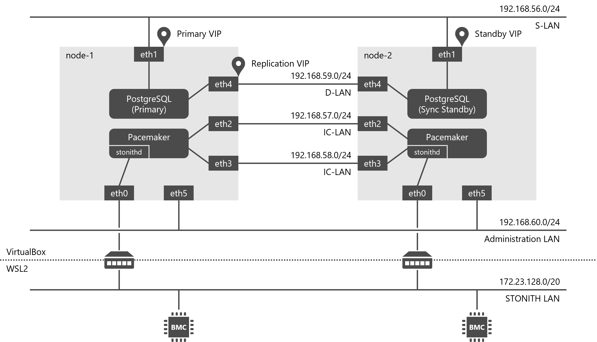

Ansible Playbook for PG-REX
===========================

Ansible playbook that set up a PostgreSQL cluster with Pacemaker based on the PG-REX standard.



Requirements
------------

The playbook is tested with the following software versions:

* VirtualBox 7.1.x
* Vagrant 2.4.x
* Vagrant box
  * [rockylinux/8](https://app.vagrantup.com/rockylinux/boxes/8)
  * [rockylinux/9](https://app.vagrantup.com/rockylinux/boxes/9)
* Ansible 2.10.x
* PG-REX 12 - 16
  * PostgreSQL 12.x - 16.x
  * Pacemaker 2.1.x
  * Pacemaker Extra Tools ([pm\_extra\_tools](https://github.com/linux-ha-japan/pm_extra_tools)) 1.6
  * PG-REX Operation Tools ([PG-REX-tools](https://github.com/ossc-db/PG-REX-tools)) 15.1 on EL8, 16.0 on EL9
* VirtualBMC VirtualBox-ported edition ([virtualbmc-vbox](https://github.com/kskmori/virtualbmc-vbox)) devel2.0

Usage
-----

To run the playbook:

```ShellSession
$ git clone https://github.com/tom-sato/ansible-pg_rex.git
$ cd ansible-pg_rex
$ vagrant up --provision
(snip)
PLAY RECAP *********************************************************************
node-1                     : ok=61   changed=46   unreachable=0    failed=0    skipped=0    rescued=0    ignored=0
node-2                     : ok=37   changed=27   unreachable=0    failed=0    skipped=16   rescued=0    ignored=0

$ ansible-playbook virtualbmc-start.yml
Using /home/tom-sato/work/ansible-pg_rex/ansible.cfg as config file
become password: (Enter your password)
(snip)
PLAY RECAP *********************************************************************
localhost                  : ok=9    changed=4    unreachable=0    failed=0    skipped=0    rescued=0    ignored=0

$ vagrant ssh node-1
$ LANG=C sudo /usr/local/bin/pg-rex_primary_start pm_pcsgen_env.xml
(snip)
Primary has started on the node (node-1).
$ exit
$ vagrant ssh node-2
$ LANG=C sudo /usr/local/bin/pg-rex_standby_start
(snip)
4.3 Checking if it is ready to run pg_basebackup
...[OK]

Following methods are available to start this node as standby
b) Start from a new base backup
q) quit
Make a choice among the options (b/q) b (Type "b" to continue)
(snip)
Standby has started on the node (node-2).
$ sudo pcs status
Cluster name: pgrex_cluster
Cluster Summary:
  * Stack: corosync (Pacemaker is running)
  * Current DC: node-1 (version 2.1.8-3.el9-3980678f0) - partition with quorum
  * Last updated: Sun Feb 23 00:41:41 2025 on node-2
  * Last change:  Sun Feb 23 00:41:02 2025 by root via root on node-1
  * 2 nodes configured
  * 11 resource instances configured

Node List:
  * Online: [ node-1 node-2 ]

Full List of Resources:
  * Clone Set: pgsql-clone [pgsql] (promotable):
    * Promoted: [ node-1 ]
    * Unpromoted: [ node-2 ]
  * Resource Group: primary-group:
    * ipaddr-primary    (ocf:heartbeat:IPaddr2):         Started node-1
    * ipaddr-replication        (ocf:heartbeat:IPaddr2):         Started node-1
  * ipaddr-standby      (ocf:heartbeat:IPaddr2):         Started node-2
  * Clone Set: ping-clone [ping]:
    * Started: [ node-1 node-2 ]
  * Clone Set: storage-mon-clone [storage-mon]:
    * Started: [ node-1 node-2 ]
  * fence1-ipmilan      (stonith:fence_ipmilan):         Started node-2
  * fence2-ipmilan      (stonith:fence_ipmilan):         Started node-1

Daemon Status:
  corosync: active/disabled
  pacemaker: active/disabled
  pcsd: active/enabled
```

Playbooks
---------

The following playbooks are available:

* `setup.yml` - Set up a PostgreSQL cluster with Pacemaker based on the PG-REX standard.
* `virtualbmc-start.yml` - Starts the VirtualBMC server.
* `virtualbmc-stop.yml` - Stops the VirtualBMC Server.

Variables
---------

The following variables are available in the `./group_vars/all.yml` file:

* `s_lan_interface` - Specifies the interface name for the service provision network "S-LAN". The default is `eth1`.
* `d_lan_interface` - Specifies the interface name for the interconnect communication network "IC-LAN". The default is `eth2`.
* `ic_lan_interfaces` - Specifies a list of interface names for the data transfer network "D-LAN". The default is `[eth3, eth4]`.
* `a_lan_interface` - Specifies the interface name for the administration network "Administration LAN". The default is `eth5`.
* `system_locale` - Specifies the system locale. The default is `ja_JP.UTF-8`.
* `system_timezone` - Specifies the system time zone. The default is `Asia/Tokyo`.
* `pacemaker_password` - Specifies the password for the `hacluster` user. The default is `hapasswd`.
* `pacemaker_cluster_name` - Specifies the cluster name. The default is `pgrex_cluster`.
* `postgresql_version` - Specifies the PostgreSQL version. The default is `16`.
* `postgresql_password` - Specifies the password for the `postgres` user. The default is `pgpasswd`.
* `postgresql_data_directory` - Specifies the data directory path. The default is `/dbfp/pgdata/data`.
* `postgresql_wal_directory` - Specifies the WAL directory path. The default is `/dbfp/pgwal/pg_wal`.
* `postgresql_archive_directory` - Specifies the archive directory path. The default is `/dbfp/pgarch/arc1`.
* `postgresql_port` - Specifies the port number for PostgreSQL server. The default is `5432`.
* `postgresql_replication_user` - Specifies the username for replication connection. The default is `repuser`.
* `postgresql_replication_password` - Specifies the password for the replication user. The default is `reppasswd`.
* `postgresql_replication_address` - Specifies the virtual IP address for the replication connection. The default is `192.168.59.111`.
* `postgresql_primary_address` - Specifies the virtual IP address for the primary connection. The default is `192.168.56.111`.
* `postgresql_standby_address` - Specifies the virtual IP address for the standby connection. The default is `192.168.56.112`.
* `monitored_addresses` - Specifies the IP addresses to be monitored for health checks. The default is the server's default gateway IP address.
* `monitored_devices` - Specifies the storage devices to be monitored for health checks. The default is all storage devices on the server.
* `ipmi_addresses` - Specifies a hash of the IP address for IPMI connection keyed by the hostname. The default is `{node-1: 172.23.135.101, node-2: 172.23.135.102}`.
* `ipmi_user` - Specifies the username for IPMI connection. The default is `Administrator`.
* `ipmi_password` - Specifies the password for the IPMI user. The default is `adminpasswd`.
* `pm_extra_tools_download_urls`- Specifies a hash of the Pacemaker Extra Tools download URL keyed by the major version of the distribution.
* `pg_rex_tools_download_urls`- Specifies a hash of the PG-REX Operation Tools download URL keyed by the major version of the distribution.

License
-------

BSD

Author Information
------------------

Tomoaki Sato
